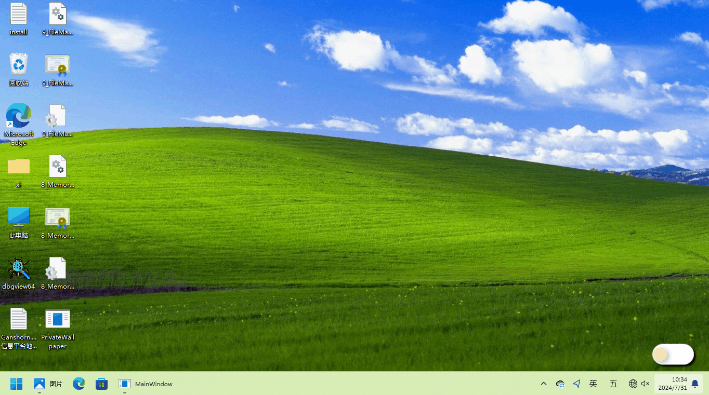

# PrivateWallpaper
Private wallpaper switcher
> Quickly switch wallpapers. Wallpaper sources can be local files, Bing Picture of the Day, dynamic wallpapers, and the WebApi(comming soon).

## features
* fast
* low system resource usage
 

## quick preview

	</img>

 

## full version demo

https://github.com/user-attachments/assets/71a0fa0a-e90f-47d5-b281-ba60938a57ce

## startup (mode1)

https://github.com/user-attachments/assets/b82599bf-58ba-4c40-90e1-075c5eba305c

## startup (mode2)

https://github.com/user-attachments/assets/c2be3225-d312-471d-8656-85bae1f8489c

# License
[MIT](LICENSE)

